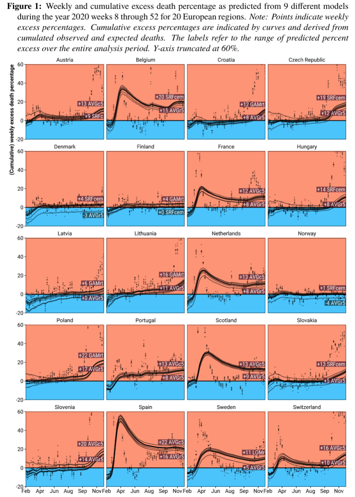

# Robustness and bias of European excess death estimates in 2020 under varying model specifications

Jonas Schöley

Various procedures are in use to calculate excess deaths during the ongoing COVID-19 pandemic. Using weekly death counts from 20 European countries, we evaluate the robustness of excess death estimates to the choice of model for expected deaths and perform a cross-validation analysis to assess the error and bias in each model's predicted death counts. We find that the different models produce very similar patterns of weekly excess deaths but disagree substantially on the level of excess. While the exact country ranking along percent excess death in 2020 is sensitive to the choice of model the top and bottom ranks are robustly identified. On the country level, the five-year average death rate model tends to produce the lowest excess death estimates, whereas high excess deaths are produced by the popular five-year average death count and Euromomo-style Serfling models. Cross-validation revealed these estimates to be biased under a causal interpretation of "expected deaths had COVID-19 not happened."
